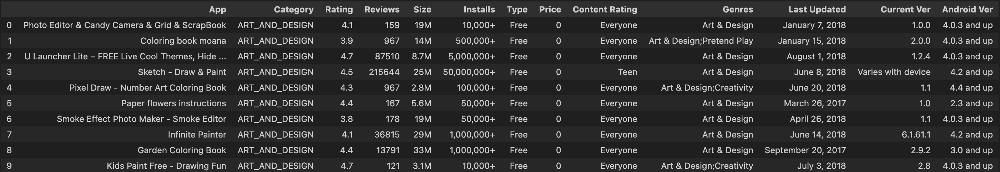
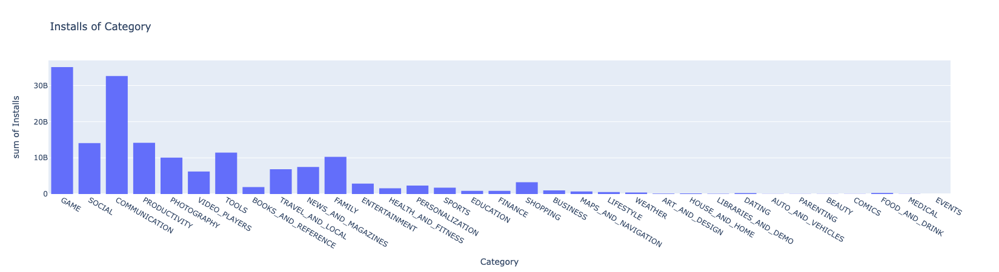
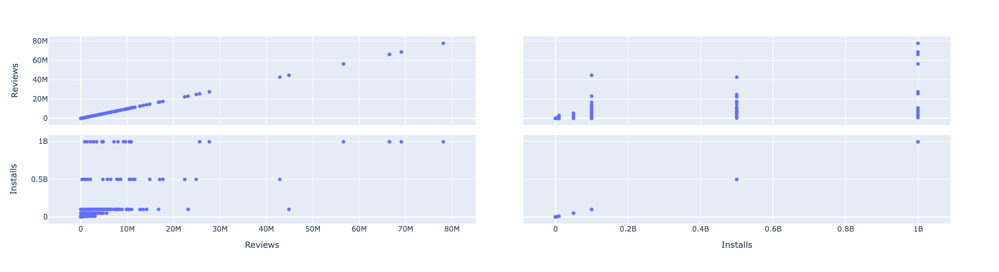

# My Mobapp Studio

## Task

The task is to analyze data from the play market and compile a detailed report of all the data existing there.

This includes tasks such as.

* What is the size of the market? numbers of download and $
* Same question but per category? (percentages please)
* Depending on each category, what are the ratio of download per app?
* Any additional information you will find useful for us to take the right decision.









## Description

we download the data set from the site https://www.kaggle.com/datasets/lava18/google-play-store-apps in csv format and translate it into.

DataFrame. After which we begin to clean it and visualize the date. Using correlations we find
compatibility, that is, a connection between categories and build another diagram - a scalar matrix.

## Installation

For the program to work correctly we must download all these necessary libraries.

```python
    pip3 install pandas
    pip3 install numpy
    pip3 install plotly.express
```


## Library Info

We need the `pandas` library to read files in csv format and for further editing

we need the `numpy` library to analyze the date and for the speed of program calculations

we need the `plotly.express` library to visualize charts

## Usage

Download all the necessary files, specify these files and run the code.
The program will do everything itself and display all the necessary diagrams for market analysis

## Help

If you have any questions, you can contact me by mail.

> mirabbosminavarov@gmail.com